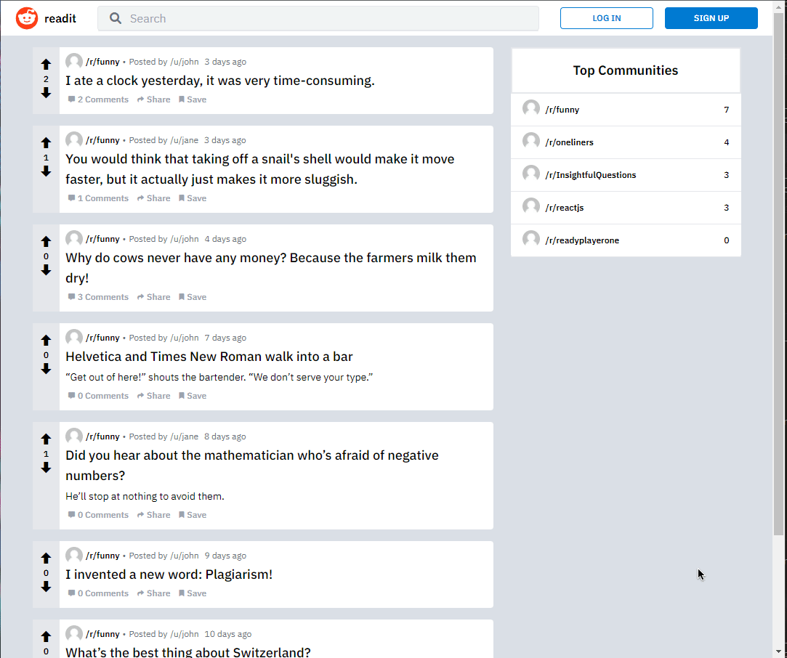

# Reddit clone
I made this project following a course made by @hidjou

## Preview

## Stack used
- NodeJS
- Express
- React
- NextJS
- TypeScript
- TypeORM
- Tailwind CSS
- PostgreSQL

## Features
- Login / Register
  - Cookies
- Authentification middleware
- Posts
  - Create
  - Upvote / Downvote
  - Search
  - Comment, upvote / downvote comments
- Sub
  - Create
  - Banner & Icon image
- Infinite scrolling
- Responsive
